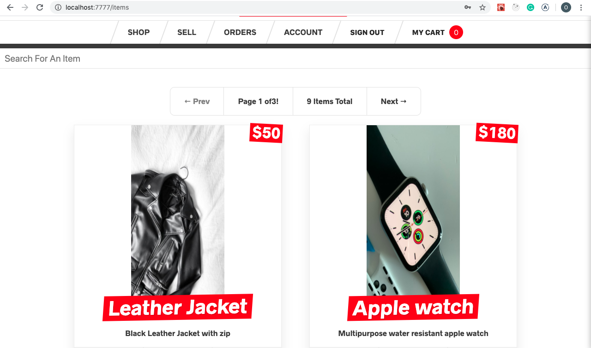
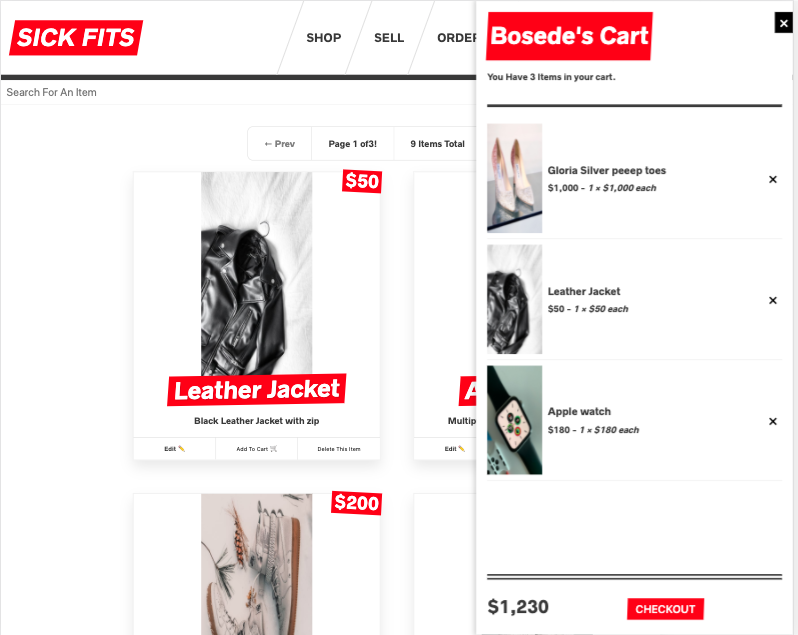
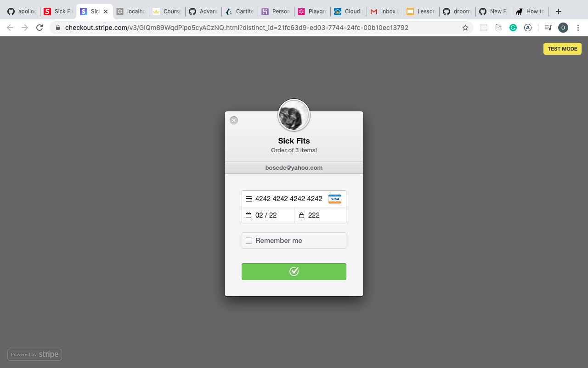
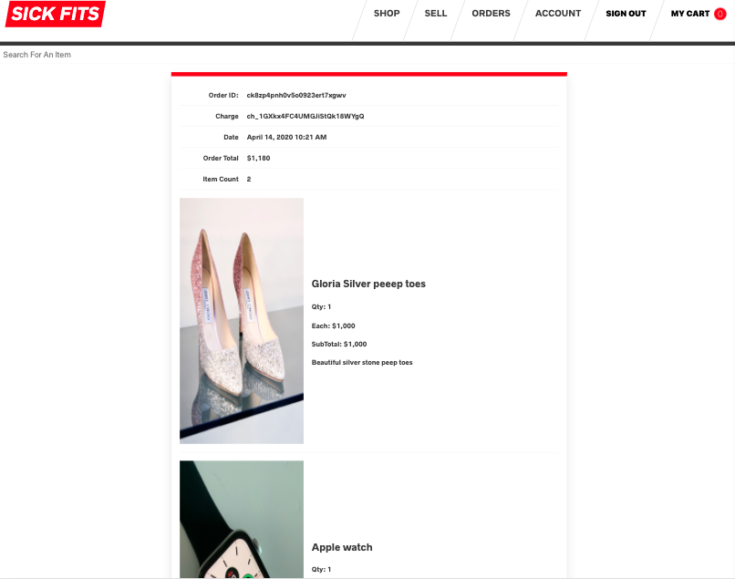

# sick-fits-store
An eCommerce website project based on Wes Bos' "Advanced react tutorial"

## Table of contents
* [General info](#general-info)
* [Inspiration](#inspiration)
* [Screenshots](#screenshots)
* [Technologies](#technologies)
* [Setup](#setup)

# General info
This project is an online fashion store built using React.Js(Next.Js) and Apollo Client for the frontend, as well as GraphQL Yoga and Prisma for the backend.
- Next.js for server side rendering, routing and tooling, Styled-components for styling, React-apollo for interfacing with Apollo Client, Jest and Enzyme for testing.
- Apollo Client for Data management: Performing GraphQL mutations, fetching GraphQL queries, Caching GraphQL data, Managing local state
- GraphQL YOGA, an Express GraphQL server for: Implementing Query and Mutation Resolvers, Custom Server Side Logic, Charging Credit Cards with Stripe, Sending Email
- Prisma, a GraphQL Database Interface: Provides a set of GraphQL CRUD APIs for a MySQL, Postgres or MongoDB Database, Schema Definition, Data Relationships

# Inspiration
This app is based on Wes Bos' "Advanced React Tutorial"; https://github.com/wesbos/Advanced-React

# Screenshots
### Home page


### Cart view


### Checkout page
\

### Order Summary page


# Technologies
* Next.js ^9.3.4
* React ^16.12.0
* apollo-client ^2.4.2
* graphql ^14.0.2
* prisma ^1.34.10
* styled-components ^3.4.9
* enzyme ^3.6.0

# Setup
To run this project, install it locally using npm:

```
clone the repository to your computer
open terminal
$ cd ../clone-location/backend
$ npm install
$ npm run dev

open new terminal
$ cd ../clone-location/frontend
$ npm install
$ npm run dev
